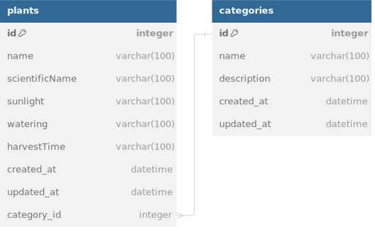

# EzFarm

EzFarm API for listing vegetables, fruits, and medicinal plants which are easy to grow in your garden.

## REST API Specification

- Production: <https://ezfarm-api.henhenmuldani.com>
- Local: <http://localhost:3000>

| Endpoints     | HTTP Method | Description        |
| ------------- | ----------- | ------------------ |
| `/plants`     | `GET`       | Get all plants     |
| `/plants/:id` | `GET`       | Get plant by id    |
| `/plants`     | `POST`      | Create new plant   |
| `/plants`     | `DELETE`    | Delete all plants  |
| `/plants/:id` | `DELETE`    | Delete plant by id |
| `/plants/:id` | `PUT`       | Update plant by id |

## Database Design/ERD



## Getting Started

To install dependencies:

```sh
bun install
```

To run:

```sh
bun run dev
```

Open http://localhost:3000
